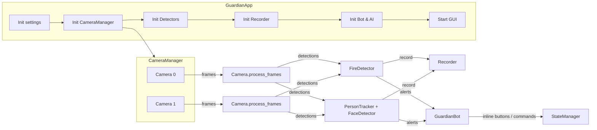

# Kiến trúc hệ thống

Tài liệu mô tả các thành phần chính của GuardianAI, luồng dữ liệu và mô hình đa luồng.

## Thành phần chính

- `GuardianApp` (`main.py`): điều phối vòng đời ứng dụng, khởi tạo Bot, GUI, Camera, Recorder, giám sát và tắt máy an toàn.
- `CameraManager` (`core/camera_manager.py`): quản lý nhiều `Camera`, khởi chạy luồng xử lý cho từng camera, truy cập frame.
- `Camera` (`core/camera.py`): lấy khung hình, tối ưu I/O, nhận biết IR, chạy pipeline phát hiện và sinh sự kiện.
- Detectors (`core/detection/*.py`):
  - `FireDetector`: phát hiện lửa/khói.
  - `FaceDetector`: nhận diện khuôn mặt (InsightFace).
  - `PersonTracker`: theo dõi người, phối hợp face detector.
- `Recorder` (`core/recorder.py`): ghi video khi có cảnh báo.
- `GuardianBot` (`bot/bot.py` + `bot/handlers.py`): gửi cảnh báo, nhận lệnh, tích hợp Trợ lý AI.
- `GUI` (`gui/*.py`): giao diện quản lý và xem camera.
- `StateManager`, `SpamGuard`, `alarm_player` (`utils/*.py`): quản lý trạng thái, chống spam, còi báo động.
- `settings` (`config/settings.py`): tải `config/config.yaml`, hỗ trợ `${ENV:"default"}`.

## Sơ đồ luồng

## Đa luồng và hiệu năng

- Mỗi `Camera` chạy một luồng xử lý riêng để đọc và xử lý khung hình.
- Bot Telegram chạy luồng riêng (polling không đồng bộ bên trong).
- GUI chạy luồng giao diện.
- `Recorder` có vòng lặp giám sát để hoàn tất file ghi.
- Tối ưu CPU: giảm độ phân giải/FPS, bỏ bớt khung, xử lý theo cấu hình (`target_fps`, `process_every_n_frames`, kích thước xử lý, v.v.).

## Dòng dữ liệu phát hiện

1. `Camera.process_frames` lấy khung hình, kiểm tra IR định kỳ, quyết định bộ lọc/tiêu chí.
2. Truyền qua `FireDetector` và/hoặc `PersonTracker` (có thể phối hợp `FaceDetector`).
3. Khi vượt ngưỡng → tạo cảnh báo: gửi ảnh/video qua Bot, hiển thị nút xác nhận.
4. `StateManager` lưu và theo dõi trạng thái cảnh báo; `SpamGuard` chống lặp.
5. `Recorder` ghi clip ngắn kèm theo cảnh báo và gửi lại cho người dùng.

## Cấu hình

- Tất cả qua `config/config.yaml` và được truy cập bởi `settings`.
- Hỗ trợ `${ENV:"default"}` để lấy giá trị từ biến môi trường.
- Tham khảo `docs/configuration.md` và `docs/config_guide.md`.
