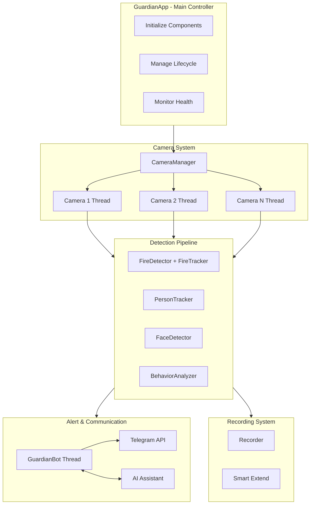
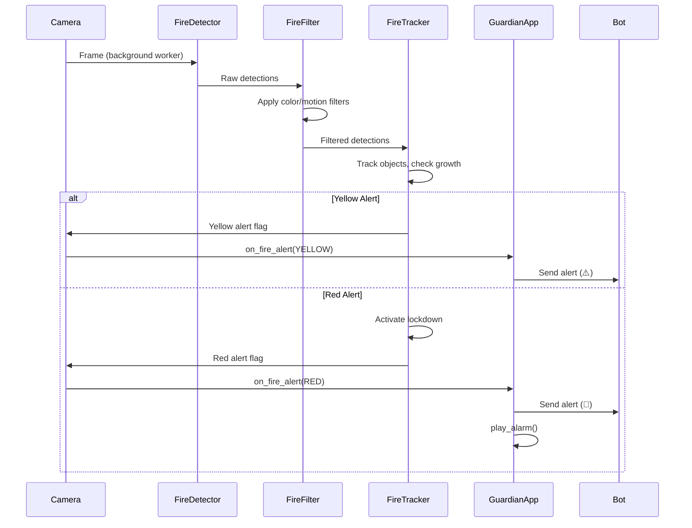
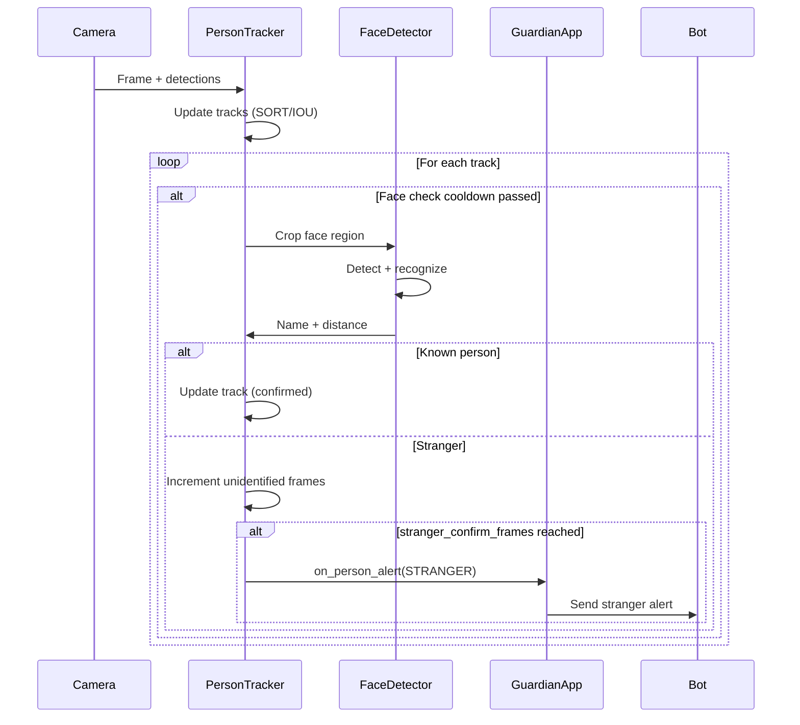
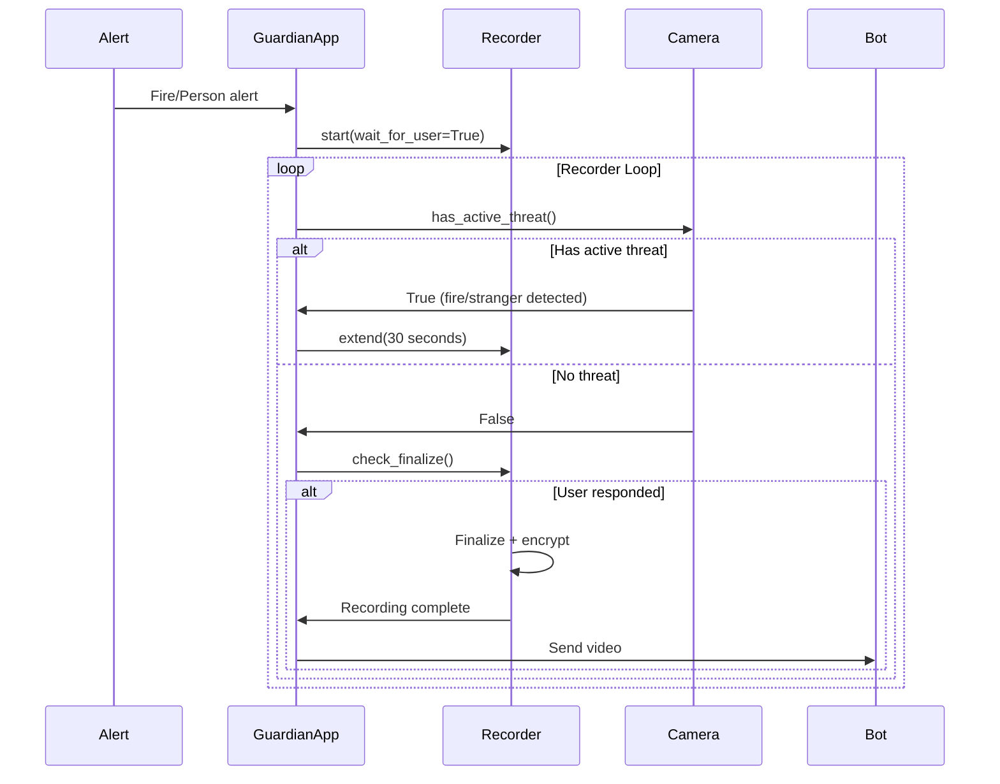

# Kiến trúc Hệ thống GuardianAI

Tài liệu này mô tả kiến trúc tổng thể, các thành phần chính, luồng dữ liệu và mô hình đa luồng của hệ thống giám sát an ninh thông minh GuardianAI.

---

## Tổng quan Kiến trúc

GuardianAI được thiết kế theo mô hình **đa luồng phân tán** (Distributed Multi-threading) với các module độc lập nhưng phối hợp chặt chẽ:



---

## Các Thành phần Chính

### 1. GuardianApp (main.py)

**Vai trò:** Điều phối vòng đời ứng dụng

**Chức năng chính:**
- Khởi tạo và quản lý tất cả các thành phần
- Điều phối luồng xử lý giữa các module
- Xử lý shutdown an toàn
- Giám sát sức khỏe hệ thống

**Các luồng được quản lý:**
- Recorder loop: Giám sát và finalize recordings
- Heartbeat loop: Gửi heartbeat định kỳ qua Telegram
- Response watcher: Theo dõi phản hồi người dùng

**Class chính:** `GuardianApp`

---

### 2. Camera System

#### 2.1 CameraManager (core/camera_manager.py)

**Vai trò:** Quản lý nhiều camera

**Chức năng:**
- Quản lý danh sách camera
- Khởi chạy/dừng luồng xử lý cho từng camera
- Cung cấp interface để truy cập frame
- Theo dõi trạng thái kết nối

**Class chính:** `CameraManager`

**Methods quan trọng:**
- `add_new_camera()`: Thêm camera mới khi đang chạy
- `get_cameras()`: Lấy danh sách camera
- `stop_all()`: Dừng tất cả camera

#### 2.2 Camera (core/camera.py)

**Vai trò:** Xử lý một camera đơn lẻ

**Chức năng chính:**
- Đọc khung hình từ nguồn (webcam/file/RTSP)
- **Tự động phát hiện chế độ IR** (Infrared)
- Áp dụng bộ lọc phù hợp (RGB/IR)
- Chạy pipeline phát hiện
- Render overlays (boxes, labels, skeleton...)
- Tự động reconnect khi mất kết nối

**Các Worker Threads:**
- `_fire_worker`: Phát hiện lửa/khói (background)
- `_behavior_worker`: Phân tích hành vi (background, nếu enabled)
- `process_loop`: Luồng xử lý chính (person detection, rendering)

**Tính năng đặc biệt:**
- **IR Detection**: Tự động nhận diện camera đang ở chế độ hồng ngoại
- **Motion Detection**: Kiểm tra optical flow để loại bỏ false positives
- **Color Filtering**: Bộ lọc màu sắc khác nhau cho RGB vs IR
- **Health Monitoring**: Theo dõi trạng thái kết nối, tự động reconnect

**Class chính:** `Camera`

**Methods quan trọng:**
- `process_loop()`: Vòng lặp xử lý chính
- `has_active_threat()`: Kiểm tra có mối đe dọa đang diễn ra
- `get_connection_status()`: Trạng thái kết nối
- `get_infrared_status()`: Kiểm tra chế độ IR

---

### 3. Detection Pipeline

#### 3.1 Fire Detection System

**FireDetector (core/detection/fire.py)**
- Phát hiện lửa/khói sử dụng YOLO
- Hỗ trợ OpenVINO/ONNX cho CPU optimization
- Áp dụng bộ lọc hậu xử lý (color, motion, brightness...)

**FireTracker (core/detection/fire_tracking.py)**
- **Theo dõi đối tượng lửa** qua các khung hình
- **Yellow Alert**: Nghi ngờ có lửa (cần xác nhận)
- **Red Alert Mode**: Cảnh báo nghiêm trọng với lockdown
- **Growth Monitoring**: Theo dõi sự tăng trưởng diện tích lửa
- **Lockdown Mechanism**: Khóa cảnh báo trong thời gian cấu hình

**FireFilter (core/detection/fire.py)**
- Bộ lọc màu sắc cho RGB mode
- Bộ lọc độ sáng cho IR mode
- Kiểm tra chuyển động (optical flow)

**Luồng xử lý:**
```
Frame → FireDetector (YOLO) → Detections → FireFilter → FireTracker
                                              ↓
                                      Yellow/Red Alert
```

#### 3.2 Person Detection & Recognition

**PersonTracker (core/detection/person.py)**
- Phát hiện người sử dụng YOLO
- Theo dõi (tracking) sử dụng SORT hoặc IOU matching
- Phối hợp với FaceDetector để nhận diện
- **ReID (Re-identification)**: Nhận diện lại người đã gặp
- **Stranger Detection**: Phát hiện người lạ
- **Alert Management**: Quản lý cảnh báo cho từng track

**FaceDetector (core/detection/face.py)**
- Sử dụng **InsightFace** (ONNX/CPU)
- Face detection + recognition
- Embedding management
- Distance-based matching với ngưỡng cấu hình

**Luồng xử lý:**
```
Frame → PersonTracker (YOLO) → Tracks → FaceDetector → Recognition
                                ↓                          ↓
                          Track Update              Known/Stranger
```

#### 3.3 Behavior Analysis (Tùy chọn)

**BehaviorAnalyzer (core/detection/behavior.py)**
- **Pose Extraction**: Sử dụng MediaPipe
- **Deep MIL Model**: Multiple Instance Learning
- **Anomaly Detection**: Phát hiện hành vi bất thường
- **Sliding Window**: Buffer 64 frames, stride 16

**Luồng xử lý:**
```
Frame → PoseExtractor → Keypoints → Buffer → Feature Processing → Model → Anomaly Score
```

---

### 4. Recording System

**Recorder (core/recorder.py)**

**Chức năng:**
- Ghi video tự động khi có cảnh báo
- **Smart Extend**: Tự động kéo dài khi có mối đe dọa
- Encryption: Mã hóa file khi hoàn tất
- Wait for user: Chờ phản hồi người dùng trước khi finalize

**Workflow:**
```
Alert → Start Recording → Write Frames → [Smart Extend?] → Finalize → Encrypt → Send
```

**Smart Extend Logic:**
```python
# Camera.has_active_threat() được gọi trong recorder loop
if camera.has_active_threat():
    recorder.extend(30)  # Kéo dài thêm 30 giây
```

---

### 5. Bot & Communication

**GuardianBot (bot/telegram.py)**

**Chức năng:**
- Nhận và xử lý lệnh Telegram
- Gửi cảnh báo với ảnh/video
- Inline buttons cho xác nhận
- Tích hợp AI Assistant

**AIAssistant**
- LLM-powered chat assistant
- Action extraction: `[ACTION:TOGGLE_ON|GET_IMAGE|...]`
- Context-aware responses
- Hỗ trợ OpenAI-compatible APIs (Gemini, LM Studio, Ollama...)

**Các lệnh chính:**
- `/start`, `/status`, `/get_image`
- `/detect [index]` - Toggle detection
- `/alarm` - Toggle alarm
- `/camera_status` - Chi tiết camera
- `/clear` - Xóa lịch sử AI

---

### 6. GUI System

**GuardianApp (gui/app.py)**

**Các tab:**
- **📹 Cameras**: Xem live feed nhiều camera
- **👥 Persons**: Quản lý khuôn mặt, rebuild embeddings
- **🎞️ Gallery**: Xem recordings đã lưu
- **⚙️ Settings**: Cấu hình runtime

**Panels:**
- `CamerasPanel`: Live view với controls
- `PersonsPanel`: Face management
- `GalleryPanel`: Recording viewer
- `SettingsPanel`: Runtime configuration

---

### 7. Utilities

**StateManager (utils/state.py)**
- Quản lý trạng thái cảnh báo
- Thread-safe state storage
- Alert tracking

**SpamGuard (utils/helpers.py)**
- Chống spam cảnh báo
- Rate limiting (max per minute)
- Debounce logic

**Security (utils/security.py)**
- File encryption/decryption
- Fernet symmetric encryption

---

## Luồng Dữ liệu Chi tiết

### 1. Fire Detection Flow



### 2. Person Recognition Flow



### 3. Recording Flow với Smart Extend



---

## Mô hình Đa luồng

### Thread Architecture

```
Main Thread (GUI)
├── CameraManager
│   ├── Camera 1 - process_loop thread
│   │   ├── Fire worker thread
│   │   └── Behavior worker thread (optional)
│   ├── Camera 2 - process_loop thread
│   │   ├── Fire worker thread
│   │   └── Behavior worker thread (optional)
│   └── Camera N...
├── GuardianBot - asyncio polling thread
├── Recorder Loop - background thread
├── Heartbeat Loop - background thread
└── Response Watchers - background threads (per alert)
```

### Thread Synchronization

**Locks & Thread-safe Structures:**
- `Camera._frame_lock`: Bảo vệ frame access
- `Recorder._lock`: Bảo vệ recording state
- `StateManager`: Thread-safe dictionary operations
- `Queue` cho communication giữa workers và main loop

**Frame Sharing:**
- Camera lưu latest frame trong `_last_frame` (protected by lock)
- Workers đọc frame một cách thread-safe
- Không cần lock khi worker xử lý (copy frame trước)

---

## Tối ưu Hiệu năng

### 1. Frame Processing

**Skip frames:**
```yaml
camera:
  process_every_n_frames: 5  # Chỉ xử lý 1/5 frames
```

**Reduce resolution:**
```yaml
camera:
  process_size: [1280, 720]  # Resize trước khi xử lý
```

**Target FPS:**
```yaml
camera:
  target_fps: 10  # Giới hạn FPS đọc
```

### 2. Model Optimization

**OpenVINO cho CPU:**
```yaml
models:
  yolo_format: openvino  # Tối ưu cho Intel CPU
```

**Model size:**
```yaml
models:
  yolo_size: small  # small/medium/large
```

### 3. Motion Detection

**Skip static scenes:**
```yaml
camera:
  motion_threshold: 25.0
  motion_min_area: 500
```

### 4. Memory Management

- Sử dụng `__slots__` trong classes
- `deque` với `maxlen` cho buffers
- Giải phóng resources khi shutdown

---

## Cấu hình

Tất cả cấu hình qua `config/config.yaml` và được truy cập bởi `settings` object.

**Nhóm cấu hình chính:**
- `camera.*`: Camera sources, FPS, IR, motion detection
- `detection.*`: Confidence thresholds
- `fire_logic.*`: Yellow/Red alert, lockdown, growth monitoring
- `models.*`: YOLO format/size, InsightFace models
- `paths.*`: Thư mục data, models, tmp
- `telegram.*`: Bot token, chat ID, timeouts
- `recorder.*`: Duration, FPS, codec
- `spam_guard.*`: Rate limiting
- `tracker.*`: Tracking timeouts, ReID
- `ai.*`: AI assistant configuration

**Xem thêm:**
- [configuration.md](file:///d:/GuardianAI/docs/configuration.md) - Tổng quan cấu hình
- [config_guide.md](file:///d:/GuardianAI/docs/config_guide.md) - Hướng dẫn chi tiết IR và Fire filters

---

## Xem thêm

- [installation.md](file:///d:/GuardianAI/docs/installation.md) - Cài đặt hệ thống
- [usage.md](file:///d:/GuardianAI/docs/usage.md) - Hướng dẫn sử dụng
- [docs/api/core.md](file:///d:/GuardianAI/docs/api/core.md) - API Reference
- [docs/features/fire_detection.md](file:///d:/GuardianAI/docs/features/fire_detection.md) - Fire Detection chi tiết
- [docs/features/person_recognition.md](file:///d:/GuardianAI/docs/features/person_recognition.md) - Person Recognition chi tiết
