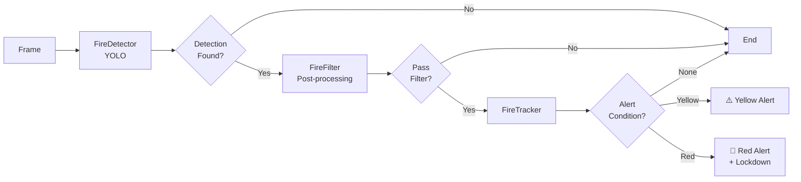

# Phát hiện Cháy & Khói (Fire Detection)

Tài liệu chi tiết về hệ thống phát hiện cháy/khói của GuardianAI, bao gồm Yellow Alert, Red Alert Mode, Fire Tracking và cấu hình chi tiết.

---

## Tổng quan

Hệ thống Fire Detection của GuardianAI kết hợp nhiều kỹ thuật để phát hiện cháy chính xác và nhanh chóng:

1. **YOLO Object Detection**: Phát hiện lửa và khói trong khung hình
2. **Post-processing Filters**: Bộ lọc màu sắc, độ sáng, chuyển động
3. **Fire Tracking**: Theo dõi đối tượng lửa qua thời gian
4. **Alert Levels**: Yellow (nghi ngờ) và Red (nghiêm trọng)
5. **Lockdown Mode**: Khóa cảnh báo để tránh spam

---

## Pipeline Tổng thể



---

## 1. Fire Detector (YOLO)

### Chức năng

- Sử dụng mô hình YOLO để phát hiện hai classes: **Fire** và **Smoke**
- Hỗ trợ nhiều định dạng: OpenVINO, ONNX, PyTorch
- Tối ưu cho CPU với OpenVINO

### Cấu hình

```yaml
models:
  yolo_format: openvino  # openvino|onnx|pytorch
  yolo_size: medium      # small|medium|large

detection:
  fire_confidence_threshold: 0.85
  smoke_confidence_threshold: 0.8
```

### Code Example

```python
from core.detection import FireDetector

detector = FireDetector()
detector.initialize()

# Detect trong frame
detections = detector.detect(frame)
# detections = [{'class': 'Fire', 'confidence': 0.92, 'bbox': [x1,y1,x2,y2], 'area': 0.05}, ...]
```

---

## 2. Fire Filter (Post-processing)

Fire Filter áp dụng các bộ lọc khác nhau tùy theo **chế độ camera** (RGB hoặc IR).

### 2.1 RGB Mode Filter

**Bộ lọc màu sắc:**

```yaml
camera:
  fire_filter:
    rgb:
      hue_fire_min: 0
      hue_fire_max: 12
      hue_orange_min: 12
      hue_orange_max: 35
      saturation_min: 80
      brightness_min: 100
      brightness_std_min: 20
      brightness_std_max: 85
      fire_color_ratio_min: 0.15
```

**Logic kiểm tra:**

1. **Màu sắc lửa**: HSV hue trong khoảng [0-35] (đỏ-cam-vàng)
2. **Độ bão hòa**: Saturation >= 80 (màu sắc rực rỡ)
3. **Độ sáng**: Brightness >= 100 và có biến đổi (std >= 20)
4. **Tỷ lệ pixel**: >= 15% pixel có màu lửa
5. **Loại bỏ ánh sáng trắng**: RGB ratio < 0.88

**Bộ lọc chuyển động (Motion):**

```yaml
camera:
  rgb:
    check_motion: true
    motion_threshold: 0.5
    motion_std_min: 0.15
```

- Sử dụng **Optical Flow** (Farneback) để phát hiện chuyển động
- Lửa có chuyển động đặc trưng, không đều (high std)
- Loại bỏ false positives từ ánh sáng tĩnh (đèn, reflection)

### 2.2 IR Mode Filter

Khi camera ở chế độ hồng ngoại, sử dụng bộ lọc độ sáng:

```yaml
camera:
  fire_filter:
    infrared:
      brightness_mean_min: 120
      brightness_max_min: 180
      brightness_std_min: 25
      brightness_std_max: 100
      bright_core_ratio_min: 0.08
      bright_core_threshold: 200
```

**Logic kiểm tra:**

1. **Độ sáng trung bình**: Mean >= 120
2. **Độ sáng tối đa**: Max >= 180
3. **Biến đổi độ sáng**: Std trong [25, 100]
4. **Vùng sáng nhất**: >= 8% pixel > 200 (hot spot)
5. **Gradient & Edge**: Phát hiện biên không đều của lửa

> [!NOTE]
> **Smoke Detection tự động bị tắt trong IR mode** vì khói không hiển thị rõ trong hồng ngoại.

---

## 3. Fire Tracker

### Chức năng

**FireTracker** theo dõi các đối tượng lửa qua thời gian để:
- Loại bỏ false positives tạm thời
- Theo dõi sự tăng trưởng diện tích lửa
- Kích hoạt Yellow hoặc Red Alert

### 3.1 Tracked Fire Object

Mỗi đối tượng lửa được theo dõi với thông tin:

```python
@dataclass
class TrackedFireObject:
    id: int
    bbox: Tuple[int, int, int, int]
    area: float                  # Diện tích (% của frame)
    first_seen: float            # Timestamp
    last_seen: float
    age: int = 0                 # Số khung hình xuất hiện
    stability_score: float = 0.0 # Độ ổn định (0-1)
    matched_count: int = 0       # Số lần match thành công
```

### 3.2 Yellow Alert (Cảnh báo Vàng)

**Điều kiện kích hoạt:**

```yaml
fire_logic:
  yellow_alert_frames: 8  # Số khung hình tối thiểu
  window_seconds: 15      # Trong cửa sổ thời gian
```

- Phát hiện lửa trong **ít nhất 8 khung hình** trong vòng **15 giây**
- Gửi cảnh báo với biểu tượng ⚠️
- Cho phép người dùng xác nhận qua Telegram

**Mục đích:**
- Phát hiện sớm các đám cháy nhỏ
- Yêu cầu xác nhận từ người dùng
- Giảm thiểu false positives

### 3.3 Red Alert Mode (Cảnh báo Đỏ)

**Điều kiện kích hoạt một trong hai:**

#### Option 1: Fire Growth (Tăng trưởng diện tích)

```yaml
fire_logic:
  red_alert_growth_threshold: 1.3  # Tăng 30%
  red_alert_growth_window: 10      # Trong 10 khung hình
```

- Diện tích lửa tăng >= 30% trong 10 khung hình liên tiếp

#### Option 2: Large Fire Area (Diện tích lớn)

```yaml
fire_logic:
  red_alert_area_threshold: 0.05  # 5% khung hình
```

- Diện tích lửa >= 5% tổng diện tích khung hình

**Hành động khi Red Alert:**

1. 🚨 Gửi cảnh báo khẩn cấp qua Telegram
2. 🔊 Bật còi báo động (alarm)
3. 🔒 **Kích hoạt Lockdown Mode**

### 3.4 Lockdown Mode

Khi Red Alert được kích hoạt:

```yaml
fire_logic:
  lockdown_seconds: 300  # 5 phút
```

**Trong thời gian lockdown:**
- Không gửi thêm cảnh báo (tránh spam)
- Tiếp tục theo dõi đối tượng lửa
- Vẫn ghi hình và gửi video
- Còi báo động tiếp tục phát

**Kết thúc lockdown:**
- Sau `lockdown_seconds` giây
- Hoặc khi người dùng tắt alarm thủ công

### 3.5 Fire Object Tracking

**Thuật toán tracking:**

1. **IOU Matching**: Tính Intersection over Union giữa detection mới và tracked objects
2. **Update hoặc Create**:
   - IOU >= `iou_threshold` → Update object hiện tại
   - IOU < threshold → Tạo object mới
3. **Cleanup**: Xóa objects không được match sau `max_age` frames

**Cấu hình:**

```yaml
fire_logic:
  object_analysis:
    enabled: true
    iou_threshold: 0.4
    max_age: 20
    min_age_for_warning: 10        # Object phải tồn tại >= 10 frames
    min_stability_for_warning: 0.8 # Stability score >= 0.8
    growth_threshold: 1.7          # Tăng 70% = object đang lan rộng
    large_fire_threshold: 0.12     # 12% frame = large fire
```

---

## 4. Workflow Chi tiết

### 4.1 Detection Workflow

```python
# 1. Camera worker gọi FireDetector
detections = fire_detector.detect(frame)

# 2. Áp dụng filter
filtered = []
for det in detections:
    bbox = det['bbox']
    crop = frame[y1:y2, x1:x2]
    
    if is_ir_mode:
        if fire_filter.check_ir_conditions(crop):
            filtered.append(det)
    else:  # RGB mode
        if fire_filter.check_rgb_conditions(crop):
            filtered.append(det)

# 3. Update tracker
should_alert, is_yellow, is_red = fire_tracker.update(filtered, now=time.time())

# 4. Trigger alert
if should_alert:
    if is_red:
        camera.on_fire_alert(source_id, frame, "RED")
    elif is_yellow:
        camera.on_fire_alert(source_id, frame, "YELLOW")
```

### 4.2 Alert Workflow

```python
# GuardianApp xử lý alert
def _on_fire_alert(self, source_id, frame, alert_type):
    # 1. Kiểm tra spam guard
    if not spam_guard.should_alert("fire", source_id):
        return
    
    # 2. Lưu frame
    alert_id = uuid.uuid4().hex
    path = save_frame(frame, alert_id)
    
    # 3. Bắt đầu recording (wait for user response)
    recorder.start(source_id, reason="fire", wait_for_user=True)
    
    # 4. Gửi cảnh báo
    caption = f"🚨 Red Alert!" if alert_type == "RED" else "⚠️ Fire Detected"
    bot.schedule_alert(chat_id, path, caption, alert_id, is_fire=True)
    
    # 5. Nếu Red Alert: bật còi
    if alert_type == "RED":
        play_alarm()
        
        # Watch fire alert (chỉ tắt còi khi user phản hồi)
        threading.Thread(
            target=_watch_fire_alert,
            args=(alert_id,),
            daemon=True
        ).start()
```

---

## 5. Smart Extend Recording

Khi có cảnh báo cháy, recording sẽ tự động kéo dài nếu phát hiện **vẫn còn mối đe dọa**.

### Logic

```python
# In recorder loop
def _recorder_loop(self):
    while not shutdown:
        rec = recorder.current
        if rec:
            camera = camera_manager.get_camera(rec['source_id'])
            
            # Kiểm tra mối đe dọa
            if camera.has_active_threat():
                recorder.extend(30)  # Kéo dài thêm 30 giây
                
        time.sleep(1)

# Camera.has_active_threat()
def has_active_threat(self):
    # Kiểm tra fire
    if self.fire_tracker.is_yellow_alert() or self.fire_tracker.is_red_alert():
        return True
    
    # Kiểm tra stranger
    if self.person_tracker.has_active_threats():
        return True
    
    return False
```

**Kết quả:**
- Recording tự động kéo dài khi cháy vẫn diễn ra
- Chỉ dừng khi không còn phát hiện lửa
- Đảm bảo ghi lại toàn bộ sự kiện

---

## 6. Telegram Alerts

### Yellow Alert

```
⚠️ **Fire Detected** - Camera 0

Nghi ngờ phát hiện lửa. Vui lòng xác nhận.

[📸 Image attached]

Buttons:
[✅ Cháy thật]  [❌ Báo động giả]  [📞 Gọi PCCC (114)]
```

### Red Alert

```
🚨 **RED ALERT - FIRE!** - Camera 0

CẢNH BÁO NGHIÊM TRỌNG: Phát hiện cháy đang lan rộng!

[📸 Image attached]

🚨 Còi báo động đã được kích hoạt
🎥 Đang ghi hình...

Buttons:
[✅ Xác nhận]  [❌ Tắt còi]  [📞 Gọi PCCC (114)]
```

**Sau khi recording hoàn tất:**

```
🎥 Video Event - Fire Alert

[🎬 Video attached (10-60s)]

Buttons:
[✅ Đã xử lý]  [⚠️ Cần hỗ trợ]
```

---

## 7. Cấu hình & Tuning

### 7.1 Giảm False Positives (Cảnh báo sai)

**Vấn đề:** Hệ thống báo cháy khi không có lửa

**Giải pháp:**

```yaml
# Option 1: Tăng confidence threshold
detection:
  fire_confidence_threshold: 0.90  # Tăng từ 0.85

# Option 2: Bật motion check (RGB)
camera:
  rgb:
    check_motion: true
    motion_threshold: 0.6  # Tăng ngưỡng

# Option 3: Tăng yellow alert frames
fire_logic:
  yellow_alert_frames: 12  # Tăng từ 8

# Option 4: Tăng ngưỡng Red Alert
fire_logic:
  red_alert_growth_threshold: 1.5  # Tăng từ 1.3
  red_alert_area_threshold: 0.08   # Tăng từ 0.05
```

### 7.2 Giảm False Negatives (Bỏ lỡ cháy thật)

**Vấn đề:** Có lửa nhưng không cảnh báo

**Giải pháp:**

```yaml
# Option 1: Giảm confidence threshold
detection:
  fire_confidence_threshold: 0.75  # Giảm từ 0.85

# Option 2: Giảm yellow alert frames
fire_logic:
  yellow_alert_frames: 5  # Giảm từ 8
  window_seconds: 20      # Tăng cửa sổ

# Option 3: Giảm Red Alert thresholds
fire_logic:
  red_alert_growth_threshold: 1.2  # Giảm từ 1.3
  red_alert_area_threshold: 0.03   # Giảm từ 0.05

# Option 4: Lỏng motion check (nếu enabled)
camera:
  rgb:
    motion_threshold: 0.3   # Giảm từ 0.5
    motion_std_min: 0.10    # Giảm từ 0.15
```

### 7.3 Tối ưu cho IR Camera

Xem [docs/features/ir_camera.md](file:///d:/GuardianAI/docs/features/ir_camera.md) và [docs/config_guide.md](file:///d:/GuardianAI/docs/config_guide.md) để biết chi tiết.

---

## 8. Benchmark & Performance

### Latency

```
Fire Detection (Small OpenVINO/CPU):
- avg_latency_ms: 20.72
- fps: 48.26
```

**Tối ưu:**

```yaml
# Giảm resolution
camera:
  process_size: [640, 360]

# Skip frames
camera:
  process_every_n_frames: 10

# Sử dụng OpenVINO
models:
  yolo_format: openvino
  yolo_size: small
```

---

## 9. Troubleshooting

### Vấn đề 1: Còi báo không tắt

**Nguyên nhân:** User chưa phản hồi alert

**Giải pháp:**
- Nhấn nút "❌ Tắt còi" trong Telegram
- Hoặc dùng `/alarm` để toggle thủ công

### Vấn đề 2: Quá nhiều Yellow Alerts

**Giải pháp:** Tăng `yellow_alert_frames` hoặc bật motion check

### Vấn đề 3: Không nhận Red Alert

**Giải pháp:** Kiểm tra logs để xem fire object có được tracked đủ lâu không, có thể giảm `min_age_for_warning`

### Vấn đề 4: Lockdown quá ngắn/dài

**Giải pháp:** Điều chỉnh `lockdown_seconds` (mặc định 300s = 5 phút)

---

## 10. API Reference

### FireDetector

```python
class FireDetector:
    def initialize() -> bool
    def detect(frame: np.ndarray, conf: float = None) -> List[dict]
```

### FireFilter

```python
class FireFilter:
    def check_rgb_conditions(crop: np.ndarray) -> bool
    def check_ir_conditions(crop: np.ndarray) -> bool
    def _check_motion(crop: np.ndarray) -> bool
```

### FireTracker

```python
class FireTracker:
    def update(detections: List[dict], now: float) -> Tuple[bool, bool, bool]
    def is_red_alert(self) -> bool
    def is_yellow_alert(self) -> bool
    @property tracked_objects(self) -> List[TrackedFireObject]
```

**Xem thêm:** [docs/api/core.md](file:///d:/GuardianAI/docs/api/core.md)

---

## Xem thêm

- [architecture.md](file:///d:/GuardianAI/docs/architecture.md) - Kiến trúc tổng thể
- [configuration.md](file:///d:/GuardianAI/docs/configuration.md) - Cấu hình hệ thống
- [config_guide.md](file:///d:/GuardianAI/docs/config_guide.md) - Hướng dẫn chi tiết Fire Filters (RGB/IR)
- [docs/features/ir_camera.md](file:///d:/GuardianAI/docs/features/ir_camera.md) - Camera hồng ngoại
- [troubleshooting.md](file:///d:/GuardianAI/docs/troubleshooting.md) - Khắc phục sự cố
