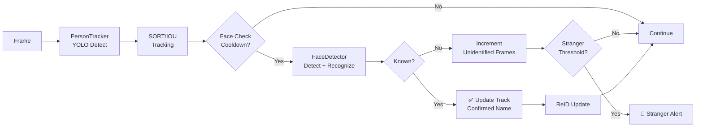
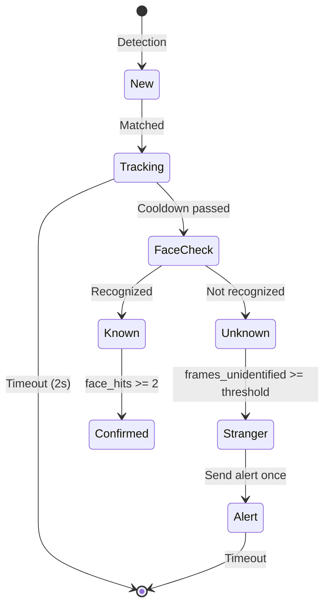

# Nhận diện Người & Khuôn mặt (Person Recognition)

Tài liệu chi tiết về hệ thống phát hiện và nhận diện người của GuardianAI, bao gồm Person Tracking, Face Recognition, Stranger Detection và ReID.

---

## Tổng quan

Hệ thống Person Recognition kết hợp nhiều kỹ thuật AI để:

1. **Person Detection**: Phát hiện người trong khung hình (YOLO)
2. **Person Tracking**: Theo dõi người qua các khung hình (SORT/IOU)
3. **Face Recognition**: Nhận diện khuôn mặt (InsightFace)
4. **ReID**: Re-identification - Nhận diện lại người đã gặp
5. **Stranger Alert**: Cảnh báo khi phát hiện người lạ

---

## Pipeline Tổng thể



---

## 1. Person Detection (YOLO)

### Chức năng

- Phát hiện người trong khung hình sử dụng YOLO
- Trả về bounding boxes và confidence scores

### Cấu hình

```yaml
models:
  yolo_format: openvino  # openvino|onnx|pytorch
  yolo_size: medium      # small|medium|large

detection:
  person_confidence_threshold: 0.6  # Ngưỡng confidence
```

### Usage

```python
from core.detection import PersonTracker

tracker = PersonTracker()
tracker.initialize()

# Detect persons
detections = tracker.detect(frame, conf=0.6)
# detections = [(x1, y1, x2, y2, confidence), ...]
```

---

## 2. Person Tracking

### 2.1 Tracking Methods

PersonTracker hỗ trợ hai phương pháp tracking:

#### Option 1: SORT (Simple Online Realtime Tracking)

```python
# Nếu có supervision library
tracker = PersonTracker()
tracker.initialize()  # Tự động sử dụng SORT nếu có
```

**Ưu điểm:**
- Tracking chính xác hơn
- Xử lý occlusion tốt
- Track ID ổn định

**Nhược điểm:**
- Cần thêm dependency (`supervision`)

#### Option 2: IOU Matching

```python
# Fallback nếu không có SORT
# Tự động sử dụng khi supervision không khả dụng
```

**Ưu điểm:**
- Không cần dependency
- Nhẹ và nhanh

**Nhược điểm:**
- Kém chính xác hơn SORT
- Dễ mất track khi occlusion

### 2.2 Track Data Structure

```python
@dataclass
class Track:
    bbox: Tuple[int, int, int, int]
    name: str = "Stranger"
    distance: float = float('inf')
    last_seen: float = 0
    face_hits: int = 0                 # Số lần nhận diện thành công
    last_face_check: float = 0
    confirmed_name: Optional[str] = None
    alert_sent: bool = False
    stranger_alert_sent: bool = False
    frames_unidentified: int = 0       # Đếm số khung hình chưa nhận diện
    reid_id: Optional[int] = None      # ReID identifier
    reid_embedding: Optional[np.ndarray] = None
```

### 2.3 Track Lifecycle



---

## 3. Face Recognition

### 3.1 Face Detector (InsightFace)

**Chức năng:**
- Face detection trong crop region
- Face embedding extraction
- Cosine distance matching với known faces

**Models:**

```yaml
models:
  face:
    detector_name: Small   # Small|Medium|Large
    recognizer_name: Small # Small|Medium|Large
  insightface_ctx_id: 0
  insightface_det_size: [640, 640]
```

### 3.2 Face Recognition Workflow

```python
# 1. Crop face region từ person bbox
x1, y1, x2, y2 = track.bbox
crop = frame[y1:y2, x1:x2]

# 2. Detect faces trong crop
faces = face_detector.detect_faces(crop)

if faces:
    # 3. Recognize
    name, distance = face_detector.recognize(faces[0].embedding)
    
    # 4. Check threshold
    if distance <= threshold:  # 0.45 default
        track.name = name
        track.confirmed_name = name
        track.face_hits += 1
    else:
        track.frames_unidentified += 1
```

### 3.3 Confidence Threshold

```yaml
detection:
  face_recognition_threshold: 0.45  # Cosine distance
```

- **Giảm threshold (0.35-0.40)**: Nhận diện lỏng hơn, ít false negatives
- **Tăng threshold (0.50-0.55)**: Nhận diện chặt hơn, ít false positives

### 3.4 Face Check Cooldown

```yaml
tracker:
  face_recognition_cooldown: 2.0  # seconds
```

- Không check face liên tục mỗi frame (tốn tài nguyên)
- Chỉ check sau 2 giây kể từ lần check trước
- Giảm tải cho CPU

---

## 4. Known Person vs Stranger

### 4.1 Confirmed Known Person

**Điều kiện:**

```yaml
tracker:
  known_person_confirm_frames: 2  # Số lần nhận diện tối thiểu
```

- Face hits >= 2 lần với cùng một tên
- Confidence distance <= threshold

**Hành động:**
- Track được đánh dấu `confirmed_name`
- Không gửi alert
- Hiển thị tên trên bounding box (màu xanh)

### 4.2 Stranger Detection

**Điều kiện:**

```yaml
tracker:
  stranger_confirm_frames: 20  # Số khung hình chưa nhận diện
```

- `frames_unidentified` >= 20
- Không nhận diện được trong suốt 20 frames liên tiếp

**Hành động:**
- Gửi alert một lần qua Telegram
- Bounding box màu đỏ với label "Stranger"
- Bắt đầu recording (Smart Extend)

**Alert Message:**

```
🚨 **Người lạ phát hiện!** - Camera 0

Phát hiện người không quen biết trong khu vực giám sát.

[📸 Image attached]

Buttons:
[✅ Có nhận ra]  [❌ Không nhận ra]
```

---

## 5. ReID (Re-identification)

### 5.1 Chức năng

**ReID** cho phép hệ thống nhận diện lại người đã gặp trước đó, ngay cả khi:
- Track bị mất (timeout)
- Người đi ra ngoài frame rồi quay lại
- Camera khác phát hiện cùng một người

### 5.2 Workflow

```python
# 1. Khi có face recognition thành công
if name and distance <= threshold:
    # Update ReID
    tracker._update_reid(track, embedding, now)

# 2. _update_reid logic
def _update_reid(track, embedding, now):
    # Tìm ReID ID tương tự trong memory
    reid_id, reid_dist = _find_similar_reid(embedding)
    
    if reid_dist < distance_threshold:  # 0.35
        # Match với ReID đã có
        track.reid_id = reid_id
        reid_memory[reid_id]['embedding'] = embedding  # Update
        reid_memory[reid_id]['last_seen'] = now
    else:
        # Tạo ReID mới
        new_id = next_reid_id
        track.reid_id = new_id
        reid_memory[new_id] = {
            'embedding': embedding,
            'last_seen': now,
            'name': track.name
        }
```

### 5.3 Cấu hình

```yaml
reid:
  distance_threshold: 0.35  # Cosine distance
  ttl_seconds: 30           # Time to live cho ReID entry
```

### 5.4 ReID Memory Cleanup

```python
# Xóa ReID entries quá cũ
for reid_id, data in list(reid_memory.items()):
    if now - data['last_seen'] > ttl_seconds:
        del reid_memory[reid_id]
```

---

## 6. Alert Management

### 6.1 Alert Types

**Known Person Alert:**
- Không gửi alert mặc định
- Chỉ log trong console

**Stranger Alert:**
- Gửi một lần khi `frames_unidentified >= stranger_confirm_frames`
- Kèm ảnh và inline buttons
- Bắt đầu recording

**Anomalous Behavior Alert:**
- Nếu behavior analysis enabled
- Phát hiện hành vi bất thường

### 6.2 Alert Deduplication

```python
# Chỉ gửi alert một lần per track
if not track.stranger_alert_sent:
    send_alert(...)
    track.stranger_alert_sent = True

# Không gửi lại cho cùng một ReID trong thời gian ngắn
if reid_id in alerted_reids:
    return
alerted_reids.add(reid_id)
```

---

## 7. GUI - Person Management

### 7.1 Thêm người mới

1. Mở tab **👥 Persons**
2. Click **"Thêm Người Mới"**
3. Nhập tên
4. Chọn ảnh (nhiều ảnh tốt hơn)
5. Click **"Lưu"**

Ảnh sẽ được lưu vào `Data/Faces/<tên>/`

### 7.2 Rebuild Embeddings

**Khi nào cần rebuild:**
- Sau khi thêm người mới
- Sau khi thêm/xóa ảnh
- Khi nhận diện kém chính xác

**Cách rebuild:**
1. Tab **👥 Persons**
2. Click **"Xây Dựng Lại Tất Cả"**
3. Đợi quá trình hoàn tất

**Quá trình:**

```python
def rebuild_embeddings():
    embeddings, names = [], []
    
    for person_dir in faces_dir.iterdir():
        for img_file in person_dir.glob("*.*"):
            img = load_image(img_file)
            faces = detector.detect_faces(img)
            
            if faces:
                embeddings.append(faces[0].embedding)
                names.append(person_dir.name)
    
    # Save
    save_pickle(embeddings, "known_embeddings.pkl")
    save_pickle(names, "known_names.pkl")
```

### 7.3 Delete Face Data

1. Tab **👥 Persons**
2. Chọn người cần xóa
3. Click **"Delete Face Data"**
4. Confirm

---

## 8. Recording Integration

### Smart Extend cho Stranger

```python
# Camera.has_active_threat()
def has_active_threat(self):
    # Check if có stranger active
    if self.person_tracker.has_active_threats():
        return True
    return False

# PersonTracker.has_active_threats()
def has_active_threats(self):
    now = time.time()
    for track in self._tracks.values():
        # Stranger chưa được xác nhận và vẫn còn active
        if (track.stranger_alert_sent and 
            track.confirmed_name is None and
            now - track.last_seen < 2.0):
            return True
    return False
```

**Kết quả:**
- Recording tự động kéo dài khi stranger vẫn trong frame
- Chỉ dừng khi stranger rời khỏi hoặc được xác nhận

---

## 9. Performance & Benchmarks

### Latency

```
Person Detection (Medium OpenVINO/CPU):
- avg_latency_ms: 54.29
- fps: 18.42

Face Recognition (Small ONNX/CPU):
- avg_latency_ms: 22.42
- fps: 44.60
```

### Tối ưu

```yaml
# Giảm face check frequency
tracker:
  face_recognition_cooldown: 3.0  # Tăng từ 2.0

# Skip frames
camera:
  process_every_n_frames: 5  # Chỉ xử lý 1/5 frames

# Giảm resolution
camera:
  process_size: [960, 540]

# Sử dụng model nhỏ
models:
  yolo_size: small
  face:
    detector_name: Small
    recognizer_name: Small
```

---

## 10. Tuning & Configuration

### 10.1 Giảm False Positives (Stranger sai)

**Vấn đề:** Người quen bị nhận dạng là stranger

**Giải pháp:**

```yaml
# Option 1: Tăng số frames cần thiết
tracker:
  stranger_confirm_frames: 30  # Tăng từ 20

# Option 2: Lỏng face recognition threshold
detection:
  face_recognition_threshold: 0.50  # Tăng từ 0.45

# Option 3: Giảm số lần confirm
tracker:
  known_person_confirm_frames: 1  # Giảm từ 2
```

### 10.2 Giảm False Negatives (Bỏ lỡ stranger)

**Vấn đề:** Stranger không được phát hiện

**Giải pháp:**

```yaml
# Option 1: Giảm stranger threshold
tracker:
  stranger_confirm_frames: 15  # Giảm từ 20

# Option 2: Chặt face recognition threshold
detection:
  face_recognition_threshold: 0.40  # Giảm từ 0.45

# Option 3: Tăng face check frequency
tracker:
  face_recognition_cooldown: 1.0  # Giảm từ 2.0
```

### 10.3 Cải thiện Face Recognition Accuracy

**1. Thêm nhiều ảnh cho mỗi người:**
- Ít nhất 5-10 ảnh
- Góc độ khác nhau
- Điều kiện ánh sáng khác nhau
- Biểu cảm khác nhau

**2. Chất lượng ảnh:**
- Resolution cao
- Khuôn mặt rõ nét
- Ánh sáng tốt

**3. Rebuild embeddings định kỳ:**
- Sau khi thêm ảnh mới
- Khi model được update

---

## 11. Troubleshooting

### Vấn đề 1: Không nhận diện được ai

**Kiểm tra:**
1. Có embeddings không? `Data/known_embeddings.pkl` và `Data/known_names.pkl`
2. Có ảnh trong `Data/Faces/` không?
3. Rebuild embeddings

**Solution:**
```bash
# Trong GUI
Tab Persons → "Xây Dựng Lại Tất Cả"
```

### Vấn đề 2: Nhận diện sai tên

**Kiểm tra:**
1. Khoảng cách (distance) trong logs
2. Threshold có phù hợp không?

**Solution:**
```yaml
# Tăng threshold nếu nhận diện sai thường xuyên
detection:
  face_recognition_threshold: 0.50
```

### Vấn đề 3: Quá nhiều Stranger alerts

**Kiểm tra:**
1. Face recognition có hoạt động không?
2. Embeddings đã được load chưa?

**Solution:**
```yaml
# Tăng stranger_confirm_frames
tracker:
  stranger_confirm_frames: 30
```

### Vấn đề 4: Track bị mất thường xuyên

**Kiểm tra:**
1. Có cài `supervision` library không?
2. Timeout có quá ngắn không?

**Solution:**
```yaml
# Tăng timeout
tracker:
  timeout_seconds: 3.0  # Tăng từ 2.0
```

```bash
# Cài SORT tracker
pip install supervision
```

---

## 12. API Reference

### PersonTracker

```python
class PersonTracker:
    @classmethod
    def load_shared_model() -> YOLO
    
    def initialize() -> bool
    def detect(frame, conf=None) -> List[Tuple]
    def update(detections, frame, scale_x=1.0, scale_y=1.0, skip_face_check=False)
    def check_alerts() -> List[dict]
    def draw(frame)
    def has_active_threats() -> bool
```

### FaceDetector

```python
class FaceDetector:
    def initialize(detector="Small", recognizer="Small") -> bool
    def detect_faces(image) -> List
    def recognize(embedding) -> Tuple[Optional[str], float]
    def rebuild_embeddings() -> int
    def load_known_faces() -> bool
    
    @property known_names -> List[str]
    @property known_embeddings -> List[np.ndarray]
```

**Xem thêm:** [docs/api/core.md](file:///d:/GuardianAI/docs/api/core.md)

---

## Xem thêm

- [architecture.md](file:///d:/GuardianAI/docs/architecture.md) - Kiến trúc tổng thể
- [configuration.md](file:///d:/GuardianAI/docs/configuration.md) - Cấu hình hệ thống
- [usage.md](file:///d:/GuardianAI/docs/usage.md) - Hướng dẫn sử dụng GUI
- [docs/features/fire_detection.md](file:///d:/GuardianAI/docs/features/fire_detection.md) - Fire Detection
- [troubleshooting.md](file:///d:/GuardianAI/docs/troubleshooting.md) - Khắc phục sự cố
