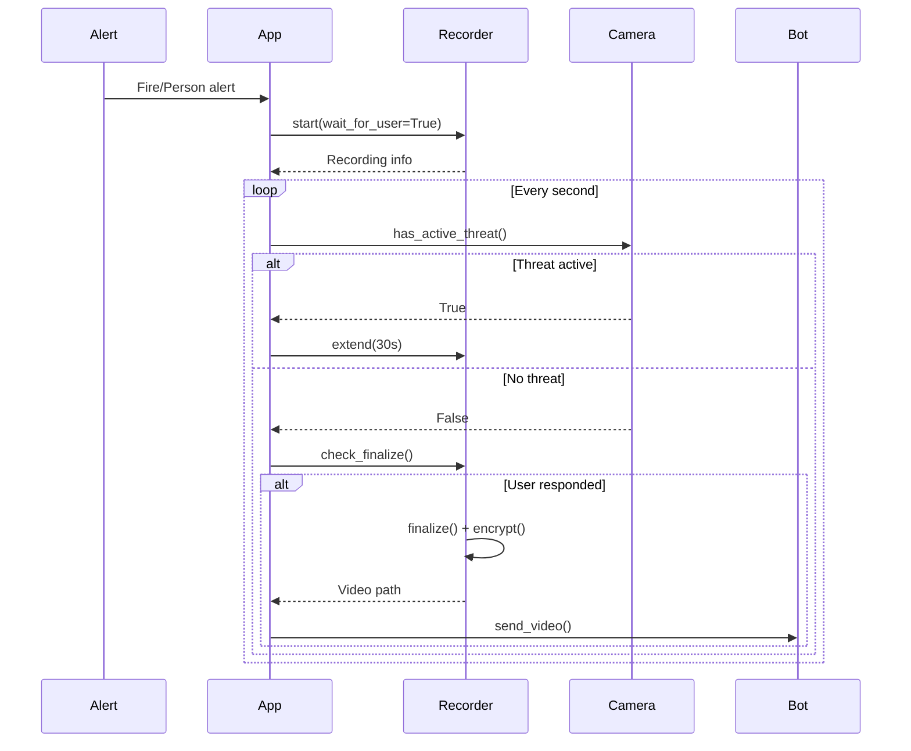
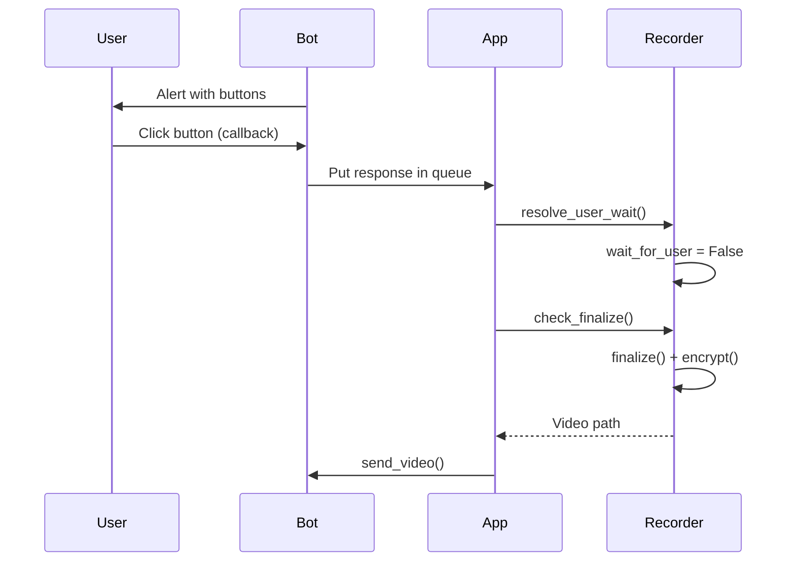

# Ghi hình Sự kiện (Event Recording)

Tài liệu về hệ thống ghi hình tự động và Smart Extend trong GuardianAI.

---

## Tổng quan

Hệ thống Recording tự động ghi lại video khi có cảnh báo (fire/stranger/anomaly) và sử dụng **Smart Extend** để kéo dài recording khi mối đe dọa vẫn còn.

**Tính năng:**
- ✅ Auto recording khi có alert
- ✅ Smart Extend (kéo dài tự động)
- ✅ Encryption sau khi hoàn tất
- ✅ Gửi video qua Telegram
- ✅ Wait for user response

---

## Workflow Tổng thể



---

## 1. Recorder Class

### Khởi tạo

```python
recorder = Recorder()
# Tự động đọc config
```

### Cấu hình

```yaml
recorder:
  duration_seconds: 10  # Thời lượng mặc định
  fps: 10.0            # FPS ghi hình
  fourcc: mp4v         # Codec (mp4v|H264|...)

paths:
  tmp_dir: Data/tmp    # Thư mục lưu recordings
```

---

## 2. Start Recording

### Basic Usage

```python
# Bắt đầu recording
rec = recorder.start(
    source_id="camera_0",
    reason="fire",           # fire|stranger|anomaly
    duration=10,             # seconds
    wait_for_user=True       # Chờ user response?
)

# rec = {
#     'path': Path(...),
#     'writer': VideoWriter,
#     'end_time': timestamp,
#     'alert_ids': [],
#     'wait_for_user': True
# }
```

### Wait for User?

**`wait_for_user=True`:**
- Recording sẽ **không tự động finalize** khi hết thời gian
- Phải đợi user phản hồi (xác nhận alert)
- Dùng cho fire alerts (quan trọng)

**`wait_for_user=False`:**
- Tự động finalize khi hết thời gian
- Dùng cho recordings không cần xác nhận

---

## 3. Write Frames

```python
# Trong camera processing loop
success = recorder.write(frame)

if not success:
    # Recording đã dừng hoặc chưa bắt đầu
    pass
```

**Auto-initialize writer:**
- Writer được tạo khi `write()` được gọi lần đầu
- Sử dụng kích thước của frame đầu tiên
- Nếu không tạo được writer → recording bị hủy

---

## 4. Smart Extend

### Logic

```python
# Trong _recorder_loop (GuardianApp)
def _recorder_loop(self):
    while not shutdown:
        rec = recorder.current
        
        if rec:
            camera = camera_manager.get_camera(rec['source_id'])
            
            # Kiểm tra mối đe dọa
            if camera.has_active_threat():
                # Kéo dài thêm 30 giây
                recorder.extend(30)
                print(f"⏱️ Recording extended by 30s")
        
        time.sleep(1)
```

### has_active_threat()

```python
# Camera method
def has_active_threat(self) -> bool:
    # 1. Check fire
    if self.fire_tracker.is_yellow_alert():
        return True
    if self.fire_tracker.is_red_alert():
        return True
    
    # 2. Check stranger
    if self.person_tracker.has_active_threats():
        return True
    
    # 3. Check anomaly (if enabled)
    if self.behavior_analyzer:
        # Check recent anomaly scores...
        pass
    
    return False
```

**Kết quả:**
- Recording tự động kéo dài khi vẫn detect fire/stranger
- Chỉ dừng khi không còn mối đe dọa
- Đảm bảo ghi đầy đủ sự kiện

---

## 5. Finalization

### Check Finalize

```python
# Trong recorder loop
finished = recorder.check_finalize()

if finished:
    # finished = {
    #     'path': Path,
    #     'source_id': str,
    #     'alert_ids': [...]
    # }
    
    # Gửi video
    send_video(chat_id, finished['path'], caption="Fire Alert")
```

### Conditions để Finalize

1. **Hết thời gian**: `time.time() >= end_time`
2. **User đã phản hồi**: `wait_for_user == False`

### Finalize Process

```python
def _finalize(self):
    # 1. Release video writer
    if writer:
        writer.release()
    
    # 2. Encrypt file
    if path.exists():
        security.encrypt_file(path)
    
    # 3. Return info
    return {
        'path': path,
        'source_id': source_id,
        'alert_ids': alert_ids
    }
```

---

## 6. User Response Integration

### Workflow



### Code

```python
# Khi user click button
def _on_callback(update, context):
    alert_id = callback_data['id']
    action = callback_data['action']
    
    # Put response vào queue
    response_queue.put({
        'alert_id': alert_id,
        'action': action,
        'user_id': user_id
    })

# Response watcher
def _watch_response(alert_id):
    timeout = 30  # seconds
    start = time.time()
    
    while time.time() - start < timeout:
        try:
            response = response_queue.get(timeout=1)
            if response['alert_id'] == alert_id:
                # Cho phép finalize
                recorder.resolve_user_wait()
                return
        except queue.Empty:
            pass

# Recorder
def resolve_user_wait(self):
    with self._lock:
        if self._current:
            self._current['wait_for_user'] = False
```

---

## 7. Encryption

### Fernet Symmetric Encryption

```python
# utils/security.py
def encrypt_file(path: Path):
    # 1. Đọc file
    data = path.read_bytes()
    
    # 2. Encrypt
    encrypted = cipher.encrypt(data)
    
    # 3. Ghi đè file
    path.write_bytes(encrypted)

def decrypt_file(path: Path):
    encrypted = path.read_bytes()
    decrypted = cipher.decrypt(encrypted)
    return decrypted
```

**Key location:** `secret.key` (root directory)

**Lưu ý:**
- Recording được encrypt sau khi finalize
- Telegram API tự động decrypt khi gửi
- GUI Gallery tự động decrypt khi xem

---

## 8. Telegram Integration

### Send Video

```python
def send_video(chat_id, video_path, caption=""):
    # 1. Decrypt nếu cần
    if is_encrypted(video_path):
        data = decrypt_file(video_path)
    else:
        data = video_path.read_bytes()
    
    # 2. Check size limit
    size_mb = len(data) / (1024 * 1024)
    if size_mb > video_preview_limit_mb:  # 48 MB default
        caption += f"\n⚠️ Video quá lớn ({size_mb:.1f}MB)"
        return
    
    # 3. Gửi
    session.post(
        f"{API_BASE}/sendVideo",
        data={'chat_id': chat_id, 'caption': caption},
        files={'video': data}
    )
```

### Size Limit

```yaml
telegram:
  video_preview_limit_mb: 48.0  # Telegram limit ~50MB
```

---

## 9. Discard Recording

### Khi nào discard?

- User click "Báo động giả"
- Camera mất kết nối giữa chừng
- Muốn hủy recording thủ công

### Code

```python
success = recorder.discard()

if success:
    print("Recording discarded")
    # File đã bị xóa
```

**Process:**
1. Release writer
2. Delete file nếu tồn tại
3. Clear current recording

---

## 10. Example: Full Workflow

```python
# 1. Fire detected
def _on_fire_alert(source_id, frame, alert_type):
    alert_id = uuid.uuid4().hex
    
    # 2. Start recording
    rec = recorder.start(
        source_id=source_id,
        reason="fire",
        duration=10,
        wait_for_user=True  # Chờ user xác nhận
    )
    
    if not rec:
        return  # Already recording
    
    # 3. Save frame
    path = save_image(frame, alert_id)
    
    # 4. Send alert
    bot.schedule_alert(
        chat_id=chat_id,
        image_path=path,
        caption="🚨 Fire Alert!",
        alert_id=alert_id,
        is_fire=True
    )
    
    # 5. Watch for user response
    threading.Thread(
        target=_watch_response,
        args=(alert_id,),
        daemon=True
    ).start()

# 6. Recorder loop (background)
def _recorder_loop():
    while not shutdown:
        rec = recorder.current
        
        if rec:
            camera = camera_manager.get_camera(rec['source_id'])
            
            # Smart Extend
            if camera.has_active_threat():
                recorder.extend(30)
            
            # Try finalize
            finished = recorder.check_finalize()
            if finished:
                # Send video
                send_video(
                    chat_id,
                    finished['path'],
                    caption="🎥 Fire Event Video"
                )
        
        time.sleep(1)

# 7. Camera loop writes frames
def process_loop():
    while not quit:
        ret, frame = cap.read()
        if ret:
            # Write to recorder
            recorder.write(frame)
```

---

## 11. Cấu hình & Tuning

### Tăng thời lượng recording

```yaml
recorder:
  duration_seconds: 20  # Tăng từ 10
```

### Giảm FPS để tiết kiệm dung lượng

```yaml
recorder:
  fps: 5.0  # Giảm từ 10.0
```

### Tăng giới hạn video size

```yaml
telegram:
  video_preview_limit_mb: 48.0
tracker:
  video_preview_limit_mb: 48.0
```

### Đổi codec

```yaml
recorder:
  fourcc: H264  # hoặc XVID, MJPG...
```

**Lưu ý:** Codec phải được hỗ trợ bởi OpenCV và system

---

## 12. Troubleshooting

### Vấn đề 1: Recording không gửi về

**Kiểm tra:**
1. File có trong `Data/tmp/` không?
2. Size có vượt quá limit không?
3. User đã phản hồi chưa?

**Giải pháp:**
```bash
# Check files
ls Data/tmp/

# Check logs
# Tìm "Recording finalized" message
```

### Vấn đề 2: Video quá ngắn

**Nguyên nhân:** Không có Smart Extend

**Giải pháp:**
```python
# Check has_active_threat() logic
# Đảm bảo fire_tracker/person_tracker hoạt động đúng
```

### Vấn đề 3: Video quá dài

**Nguyên nhân:** Smart Extend kéo dài quá nhiều

**Giải pháp:**
```yaml
# Tăng timeout để stop sớm hơn
fire_logic:
  lockdown_seconds: 120  # Giảm từ 300
```

### Vấn đề 4: File bị corrupt

**Nguyên nhân:** Writer không được release đúng cách

**Giải pháp:**
- Đảm bảo shutdown gracefully
- Không force kill app

---

## 13. API Reference

### Recorder

```python
class Recorder:
    def start(source_id, reason="alert", duration=None, 
              wait_for_user=False) -> Optional[Dict]
    
    def write(frame: np.ndarray) -> bool
    
    def extend(seconds: float)
    
    def check_finalize() -> Optional[Dict]
    
    def stop()
    
    def discard() -> bool
    
    def resolve_user_wait()
    
    @property current -> Optional[Dict]
```

**Xem thêm:** [docs/api/core.md](file:///d:/GuardianAI/docs/api/core.md)

---

## Xem thêm

- [docs/features/fire_detection.md](file:///d:/GuardianAI/docs/features/fire_detection.md) - Fire Detection
- [docs/features/person_recognition.md](file:///d:/GuardianAI/docs/features/person_recognition.md) - Person Recognition
- [architecture.md](file:///d:/GuardianAI/docs/architecture.md) - Kiến trúc
- [security.md](file:///d:/GuardianAI/docs/security.md) - Bảo mật
